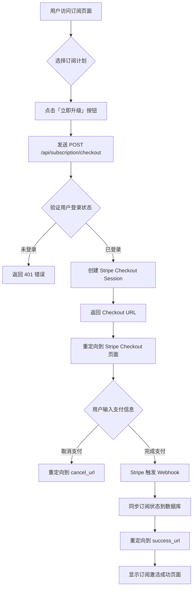

# Stripe 订阅集成完整方案

**项目**: CryptoQuant V3.0 订阅制 SaaS
**作者**: Stripe Integration Agent
**日期**: 2026-02-12
**技术栈**: Next.js 16 + Stripe Billing + Supabase + TypeScript

---

## 目录

1. [系统概览](#1-系统概览)
2. [Checkout 流程设计](#2-checkout-流程设计)
3. [Webhook 事件处理](#3-webhook-事件处理)
4. [订阅生命周期管理](#4-订阅生命周期管理)
5. [幂等性设计](#5-幂等性设计)
6. [错误处理与容错](#6-错误处理与容错)
7. [代码实现](#7-代码实现)
8. [测试方案](#8-测试方案)
9. [部署清单](#9-部署清单)

---

## 1. 系统概览

### 1.1 订阅计划

| 计划 | 月付价格 | 年付价格 | 核心功能 |
|------|---------|---------|---------|
| **Free** | $0 | $0 | 资金费率套利、20 API/min、2 交易所 |
| **Pro** | $19.9 | $191 | 所有套利、100 API/min、5 交易所、回测 |
| **Ultra** | $39.9 | $383 | 全部功能、300 API/min、无限制、模拟盘 |

### 1.2 技术架构

```
┌─────────────────────────────────────────────────────┐
│                   用户前端                           │
│        (订阅页面 + 支付按钮 + Checkout)              │
└─────────────────────────────────────────────────────┘
                    ↓ (点击升级)
┌─────────────────────────────────────────────────────┐
│           Next.js API Route                         │
│       /api/subscription/checkout                    │
│   1. 验证用户身份                                    │
│   2. 创建 Stripe Checkout Session                   │
│   3. 返回 Checkout URL                              │
└─────────────────────────────────────────────────────┘
                    ↓ (重定向)
┌─────────────────────────────────────────────────────┐
│           Stripe Checkout 页面                       │
│   用户输入支付信息 → 完成支付                        │
└─────────────────────────────────────────────────────┘
                    ↓ (支付成功)
┌─────────────────────────────────────────────────────┐
│           Stripe Webhook                            │
│       /api/webhooks/stripe                          │
│   1. 验证 Webhook 签名                               │
│   2. 幂等性检查 (event_id)                           │
│   3. 同步订阅状态到 Supabase                         │
│   4. 更新用户权限                                    │
└─────────────────────────────────────────────────────┘
                    ↓ (同步完成)
┌─────────────────────────────────────────────────────┐
│           成功页面                                   │
│       /dashboard/subscription?success=true          │
│   显示订阅激活状态 + 新功能提示                      │
└─────────────────────────────────────────────────────┘
```

### 1.3 数据库表关系

```sql
-- 订阅计划表（Stripe 产品元数据）
subscription_plans
  ├── id (UUID)
  ├── name ('free'/'pro'/'ultra')
  ├── stripe_price_id_monthly
  ├── stripe_price_id_yearly
  └── price_monthly / price_yearly

-- 用户订阅表（用户 ↔ 计划映射）
user_subscriptions
  ├── id (UUID)
  ├── user_id (FK → user_profiles.id)
  ├── plan_id (FK → subscription_plans.id)
  ├── stripe_subscription_id (Stripe Sub ID)
  ├── stripe_customer_id (Stripe Customer ID)
  ├── status ('active'/'canceled'/'past_due'/'unpaid'/'incomplete')
  ├── current_period_start / current_period_end
  ├── cancel_at_period_end (Boolean)
  └── billing_cycle ('monthly'/'yearly')

-- Webhook 事件日志表（幂等性保证）
stripe_webhook_events
  ├── id (UUID)
  ├── stripe_event_id (唯一约束)
  ├── event_type (e.g., 'checkout.session.completed')
  ├── payload (JSONB)
  ├── processed_at (TIMESTAMP)
  └── status ('pending'/'processed'/'failed')
```

---

## 2. Checkout 流程设计

### 2.1 用户操作流程



### 2.2 Checkout API 实现逻辑

#### 请求参数

```typescript
POST /api/subscription/checkout

Body:
{
  "priceId": "price_xxxxxxxxxxxxx",     // Stripe Price ID
  "billingCycle": "monthly" | "yearly"  // 计费周期
}
```

#### 响应格式

**成功响应 (200)**:
```json
{
  "url": "https://checkout.stripe.com/c/pay/cs_xxx",
  "sessionId": "cs_xxxxxxxxxxxxxxxxxxxxx"
}
```

**错误响应 (400/401/500)**:
```json
{
  "error": "Error message",
  "code": "ERROR_CODE",
  "details": "Detailed error description"
}
```

### 2.3 流程步骤详解

#### Step 1: 验证用户身份

```typescript
const supabase = createRouteHandlerClient<Database>({ cookies });
const { data: { user }, error: authError } = await supabase.auth.getUser();

if (authError || !user) {
  return NextResponse.json(
    { error: 'Unauthorized', code: 'UNAUTHORIZED' },
    { status: 401 }
  );
}
```

#### Step 2: 获取用户资料

```typescript
const { data: profile } = await supabase
  .from('user_profiles')
  .select('id')
  .eq('auth_id', user.id)
  .single();

if (!profile) {
  return NextResponse.json(
    { error: 'User profile not found', code: 'PROFILE_NOT_FOUND' },
    { status: 404 }
  );
}
```

#### Step 3: 验证价格 ID

```typescript
const validPriceIds = {
  pro: {
    monthly: process.env.STRIPE_PRICE_ID_PRO_MONTHLY,
    yearly: process.env.STRIPE_PRICE_ID_PRO_YEARLY,
  },
  ultra: {
    monthly: process.env.STRIPE_PRICE_ID_ULTRA_MONTHLY,
    yearly: process.env.STRIPE_PRICE_ID_ULTRA_YEARLY,
  },
};

// 查找对应的 Stripe Price ID
let stripePriceId: string | undefined;
for (const [plan, prices] of Object.entries(validPriceIds)) {
  if (prices[billingCycle] === priceId) {
    stripePriceId = priceId;
    break;
  }
}

if (!stripePriceId) {
  return NextResponse.json(
    { error: 'Invalid price ID', code: 'INVALID_PRICE_ID' },
    { status: 400 }
  );
}
```

#### Step 4: 检查现有订阅

```typescript
const { data: existingSubscription } = await supabase
  .from('user_subscriptions')
  .select('id, stripe_subscription_id, status, plan_id')
  .eq('user_id', profile.id)
  .single();
```

#### Step 5: 创建 Checkout Session

**新订阅场景**:
```typescript
const session = await stripe.checkout.sessions.create({
  mode: 'subscription',
  payment_method_types: ['card'],
  line_items: [
    {
      price: stripePriceId,
      quantity: 1,
    },
  ],
  success_url: `${process.env.NEXT_PUBLIC_APP_URL}/dashboard/subscription?success=true&session_id={CHECKOUT_SESSION_ID}`,
  cancel_url: `${process.env.NEXT_PUBLIC_APP_URL}/dashboard/subscription?canceled=true`,
  customer_email: user.email,
  metadata: {
    user_id: profile.id,
    billing_cycle: billingCycle,
  },
});
```

**升级/降级订阅场景**:
```typescript
// 如果已有活跃订阅，直接更新订阅而非创建新订阅
if (existingSubscription && existingSubscription.status === 'active') {
  // 使用 Stripe API 直接更新订阅
  await stripe.subscriptions.update(existingSubscription.stripe_subscription_id, {
    items: [
      {
        id: existingSubscription.stripe_subscription_item_id, // 需要获取
        price: stripePriceId,
      },
    ],
    proration_behavior: 'create_prorations', // 立即生效并按比例计费
  });

  // 重定向到订阅管理页面
  return NextResponse.json({
    url: '/dashboard/subscription?updated=true',
    sessionId: null,
  });
}
```

#### Step 6: 创建初始订阅记录（pending 状态）

```typescript
// 仅在新订阅时创建记录
if (!existingSubscription || existingSubscription.status !== 'active') {
  await supabase.from('user_subscriptions').insert({
    user_id: profile.id,
    status: 'incomplete',
    stripe_subscription_id: session.subscription as string,
    billing_cycle: billingCycle,
  });
}
```

---

## 3. Webhook 事件处理

### 3.1 关键 Webhook 事件

| 事件类型 | 触发时机 | 处理逻辑 |
|---------|---------|---------|
| `checkout.session.completed` | 用户完成支付 | 激活订阅，更新数据库状态为 `active` |
| `customer.subscription.updated` | 订阅升级/降级/续费 | 更新订阅计划和周期信息 |
| `customer.subscription.deleted` | 订阅取消/过期 | 更新状态为 `canceled`，降级到 Free |
| `invoice.payment_succeeded` | 续费成功 | 更新 `current_period_end`，重置配额 |
| `invoice.payment_failed` | 续费失败 | 更新状态为 `past_due`，发送邮件提醒 |

### 3.2 Webhook 处理架构

```
Stripe Webhook
      ↓
┌─────────────────────────────────┐
│  /api/webhooks/stripe           │
│  1. 验证签名                    │
│  2. 解析事件                    │
└─────────────────────────────────┘
      ↓
┌─────────────────────────────────┐
│  幂等性检查                      │
│  查询 stripe_webhook_events     │
│  检查 event_id 是否已处理       │
└─────────────────────────────────┘
      ↓ (未处理)
┌─────────────────────────────────┐
│  事件路由器                      │
│  根据 event.type 分发处理       │
└─────────────────────────────────┘
      ↓
┌─────────────────────────────────┐
│  事件处理器                      │
│  - handleCheckoutCompleted      │
│  - handleSubscriptionUpdated    │
│  - handleSubscriptionDeleted    │
│  - handleInvoicePaymentSucceeded│
│  - handleInvoicePaymentFailed   │
└─────────────────────────────────┘
      ↓
┌─────────────────────────────────┐
│  数据库事务                      │
│  1. 更新 user_subscriptions     │
│  2. 记录 webhook 事件            │
│  3. 更新用户配额                │
└─────────────────────────────────┘
      ↓
┌─────────────────────────────────┐
│  返回 200 OK                    │
│  Stripe 停止重试                │
└─────────────────────────────────┘
```

### 3.3 Webhook 签名验证

```typescript
// 必须在解析请求体之前获取原始 body
const body = await req.text();
const signature = headers().get('stripe-signature')!;

let event: Stripe.Event;

try {
  event = stripe.webhooks.constructEvent(
    body,
    signature,
    process.env.STRIPE_WEBHOOK_SECRET!
  );
} catch (err) {
  console.error('Webhook signature verification failed:', err);
  return NextResponse.json(
    { error: 'Invalid signature' },
    { status: 400 }
  );
}
```

### 3.4 事件处理器详细实现

#### 3.4.1 `checkout.session.completed`

**触发时机**: 用户完成支付后

**处理逻辑**:
```typescript
async function handleCheckoutCompleted(event: Stripe.Event) {
  const session = event.data.object as Stripe.Checkout.Session;

  // 1. 提取元数据
  const userId = session.metadata?.user_id;
  const billingCycle = session.metadata?.billing_cycle as 'monthly' | 'yearly';

  if (!userId) {
    throw new Error('Missing user_id in session metadata');
  }

  // 2. 获取订阅详情
  const subscription = await stripe.subscriptions.retrieve(
    session.subscription as string
  );

  // 3. 确定订阅计划（从 price_id 反查）
  const priceId = subscription.items.data[0].price.id;
  const { data: plan } = await supabase
    .from('subscription_plans')
    .select('id, name')
    .or(`stripe_price_id_monthly.eq.${priceId},stripe_price_id_yearly.eq.${priceId}`)
    .single();

  if (!plan) {
    throw new Error(`Unknown price_id: ${priceId}`);
  }

  // 4. 更新用户订阅（使用 UPSERT）
  await supabase
    .from('user_subscriptions')
    .upsert({
      user_id: userId,
      plan_id: plan.id,
      stripe_subscription_id: subscription.id,
      stripe_customer_id: session.customer as string,
      status: 'active',
      billing_cycle: billingCycle,
      current_period_start: new Date(subscription.current_period_start * 1000),
      current_period_end: new Date(subscription.current_period_end * 1000),
      cancel_at_period_end: false,
    }, {
      onConflict: 'user_id', // 如果用户已有订阅，则更新
    });

  // 5. 发送欢迎邮件（可选）
  await sendWelcomeEmail(userId, plan.name);

  console.log(`✅ Subscription activated for user ${userId}: ${plan.name}`);
}
```

#### 3.4.2 `customer.subscription.updated`

**触发时机**: 订阅升级/降级/续费

**处理逻辑**:
```typescript
async function handleSubscriptionUpdated(event: Stripe.Event) {
  const subscription = event.data.object as Stripe.Subscription;

  // 1. 查找现有订阅
  const { data: existingSubscription } = await supabase
    .from('user_subscriptions')
    .select('id, user_id')
    .eq('stripe_subscription_id', subscription.id)
    .single();

  if (!existingSubscription) {
    console.warn(`Subscription not found: ${subscription.id}`);
    return;
  }

  // 2. 确定新计划
  const priceId = subscription.items.data[0].price.id;
  const { data: newPlan } = await supabase
    .from('subscription_plans')
    .select('id, name')
    .or(`stripe_price_id_monthly.eq.${priceId},stripe_price_id_yearly.eq.${priceId}`)
    .single();

  // 3. 更新订阅信息
  await supabase
    .from('user_subscriptions')
    .update({
      plan_id: newPlan?.id,
      status: subscription.status as any,
      current_period_start: new Date(subscription.current_period_start * 1000),
      current_period_end: new Date(subscription.current_period_end * 1000),
      cancel_at_period_end: subscription.cancel_at_period_end,
    })
    .eq('id', existingSubscription.id);

  console.log(`✅ Subscription updated: ${subscription.id} → ${newPlan?.name}`);
}
```

#### 3.4.3 `customer.subscription.deleted`

**触发时机**: 订阅取消或过期

**处理逻辑**:
```typescript
async function handleSubscriptionDeleted(event: Stripe.Event) {
  const subscription = event.data.object as Stripe.Subscription;

  // 1. 查找用户订阅
  const { data: existingSubscription } = await supabase
    .from('user_subscriptions')
    .select('id, user_id')
    .eq('stripe_subscription_id', subscription.id)
    .single();

  if (!existingSubscription) {
    console.warn(`Subscription not found: ${subscription.id}`);
    return;
  }

  // 2. 降级到 Free 计划
  const { data: freePlan } = await supabase
    .from('subscription_plans')
    .select('id')
    .eq('name', 'free')
    .single();

  // 3. 更新订阅状态
  await supabase
    .from('user_subscriptions')
    .update({
      plan_id: freePlan?.id,
      status: 'canceled',
      cancel_at_period_end: false,
    })
    .eq('id', existingSubscription.id);

  // 4. 发送取消确认邮件
  await sendCancellationEmail(existingSubscription.user_id);

  console.log(`✅ Subscription canceled for user ${existingSubscription.user_id}`);
}
```

#### 3.4.4 `invoice.payment_succeeded`

**触发时机**: 续费成功

**处理逻辑**:
```typescript
async function handleInvoicePaymentSucceeded(event: Stripe.Event) {
  const invoice = event.data.object as Stripe.Invoice;

  // 忽略非订阅发票（如一次性支付）
  if (!invoice.subscription) return;

  // 1. 获取订阅详情
  const subscription = await stripe.subscriptions.retrieve(
    invoice.subscription as string
  );

  // 2. 更新订阅周期
  await supabase
    .from('user_subscriptions')
    .update({
      status: 'active',
      current_period_start: new Date(subscription.current_period_start * 1000),
      current_period_end: new Date(subscription.current_period_end * 1000),
    })
    .eq('stripe_subscription_id', subscription.id);

  console.log(`✅ Invoice paid for subscription ${subscription.id}`);
}
```

#### 3.4.5 `invoice.payment_failed`

**触发时机**: 续费失败

**处理逻辑**:
```typescript
async function handleInvoicePaymentFailed(event: Stripe.Event) {
  const invoice = event.data.object as Stripe.Invoice;

  // 忽略非订阅发票
  if (!invoice.subscription) return;

  // 1. 更新订阅状态为 past_due
  await supabase
    .from('user_subscriptions')
    .update({ status: 'past_due' })
    .eq('stripe_subscription_id', invoice.subscription as string);

  // 2. 发送支付失败邮件
  const { data: subscription } = await supabase
    .from('user_subscriptions')
    .select('user_id')
    .eq('stripe_subscription_id', invoice.subscription as string)
    .single();

  if (subscription) {
    await sendPaymentFailedEmail(subscription.user_id);
  }

  console.log(`⚠️ Payment failed for subscription ${invoice.subscription}`);
}
```

---

## 4. 订阅生命周期管理

### 4.1 创建订阅（新用户）

**场景**: 用户从 Free 升级到 Pro/Ultra

**流程**:
```typescript
// 用户点击「立即升级」
POST /api/subscription/checkout
  ↓
创建 Stripe Checkout Session
  ↓
用户在 Stripe 页面输入支付信息
  ↓
Webhook: checkout.session.completed
  ↓
数据库状态: status = 'active'
  ↓
前端展示: 订阅激活成功 ✅
```

**数据库操作**:
```sql
-- 创建初始记录（checkout API）
INSERT INTO user_subscriptions (
  user_id, status, stripe_subscription_id, billing_cycle
) VALUES (
  'user-uuid', 'incomplete', 'sub_xxxxx', 'monthly'
);

-- 激活订阅（webhook）
UPDATE user_subscriptions
SET
  status = 'active',
  plan_id = 'pro-plan-uuid',
  stripe_customer_id = 'cus_xxxxx',
  current_period_start = '2026-02-12',
  current_period_end = '2026-03-12'
WHERE stripe_subscription_id = 'sub_xxxxx';
```

### 4.2 升级订阅（Pro → Ultra）

**场景**: 用户从 Pro 升级到 Ultra

**流程**:
```typescript
// 用户点击「升级到 Ultra」
调用 Stripe API 直接更新订阅（无需 Checkout）
  ↓
stripe.subscriptions.update(subscriptionId, {
  items: [{ id: itemId, price: ultraPriceId }],
  proration_behavior: 'create_prorations', // 立即生效 + 按比例计费
})
  ↓
Webhook: customer.subscription.updated
  ↓
数据库状态: plan_id = 'ultra-plan-uuid'
  ↓
前端展示: 升级成功 ✅，立即享受 Ultra 功能
```

**按比例计费逻辑**:
- 假设用户在 Pro 月付的第 15 天升级到 Ultra：
  - 已使用 Pro: 15 天 × $19.9 / 30 天 = $9.95
  - 未使用 Pro: 15 天 × $19.9 / 30 天 = $9.95（退款到余额）
  - Ultra 剩余天数: 15 天 × $39.9 / 30 天 = $19.95
  - 用户需支付: $19.95 - $9.95 = $10.00

### 4.3 降级订阅（Ultra → Pro）

**场景**: 用户从 Ultra 降级到 Pro

**流程**:
```typescript
// 用户点击「降级到 Pro」
调用 Stripe API 更新订阅（账期结束后生效）
  ↓
stripe.subscriptions.update(subscriptionId, {
  items: [{ id: itemId, price: proPriceId }],
  proration_behavior: 'none', // 账期结束后生效，不产生退款
})
  ↓
数据库状态: cancel_at_period_end = false，但记录下次计划
  ↓
Webhook: customer.subscription.updated（在账期结束时触发）
  ↓
数据库状态: plan_id = 'pro-plan-uuid'
  ↓
前端展示: 降级将在 [日期] 生效
```

**推荐策略**:
- 立即降级：使用 `proration_behavior: 'create_prorations'`（按比例退款）
- 账期结束后降级：使用 `proration_behavior: 'none'`（用户体验更好）

### 4.4 取消订阅

**场景**: 用户取消订阅

**两种取消模式**:

#### 模式 1: 立即取消（推荐用于免费用户）

```typescript
await stripe.subscriptions.cancel(subscriptionId);

// Webhook: customer.subscription.deleted
// 数据库状态: status = 'canceled', plan_id = 'free-plan-uuid'
```

#### 模式 2: 账期结束后取消（推荐用于付费用户）

```typescript
await stripe.subscriptions.update(subscriptionId, {
  cancel_at_period_end: true,
});

// Webhook: customer.subscription.updated
// 数据库状态: cancel_at_period_end = true

// 账期结束后触发 customer.subscription.deleted
// 数据库状态: status = 'canceled', plan_id = 'free-plan-uuid'
```

**前端提示**:
```typescript
if (subscription.cancel_at_period_end) {
  return (
    <Alert variant="warning">
      您的订阅将在 {formatDate(subscription.current_period_end)} 到期，
      届时将自动降级到 Free 计划。
      <Button onClick={reactivateSubscription}>恢复订阅</Button>
    </Alert>
  );
}
```

### 4.5 订阅过期

**场景**: 订阅到期且未续费

**流程**:
```
账期结束 (current_period_end)
  ↓
Stripe 尝试扣款（自动续费）
  ↓
┌─────────────────────────┐
│  扣款成功               │
│  ↓                      │
│  invoice.payment_succeeded
│  ↓                      │
│  订阅续费成功            │
└─────────────────────────┘

┌─────────────────────────┐
│  扣款失败               │
│  ↓                      │
│  invoice.payment_failed │
│  ↓                      │
│  status = 'past_due'    │
│  ↓                      │
│  3 次重试后仍失败        │
│  ↓                      │
│  customer.subscription.deleted
│  ↓                      │
│  降级到 Free 计划        │
└─────────────────────────┘
```

**Stripe 重试策略**:
- 第 1 次失败: 3 天后重试
- 第 2 次失败: 5 天后重试
- 第 3 次失败: 7 天后重试
- 第 4 次失败: 取消订阅

---

## 5. 幂等性设计

### 5.1 为什么需要幂等性？

**问题场景**:
- Webhook 重复发送（网络重试）
- 并发请求处理同一事件
- 系统故障后重新处理

**后果**:
- 订阅状态错误（如 Free 用户被重复激活）
- 配额计数错误
- 数据库数据不一致

### 5.2 幂等性实现方案

#### 方案 1: 数据库唯一约束 + Event Log

**创建事件日志表**:
```sql
CREATE TABLE IF NOT EXISTS public.stripe_webhook_events (
  id UUID PRIMARY KEY DEFAULT gen_random_uuid(),
  stripe_event_id VARCHAR(100) UNIQUE NOT NULL,  -- Stripe Event ID（唯一）
  event_type VARCHAR(50) NOT NULL,               -- 事件类型
  payload JSONB NOT NULL,                         -- 完整事件数据
  status VARCHAR(20) DEFAULT 'pending'
    CHECK (status IN ('pending', 'processed', 'failed')),
  processed_at TIMESTAMP WITH TIME ZONE,
  error_message TEXT,
  created_at TIMESTAMP WITH TIME ZONE DEFAULT NOW()
);

CREATE INDEX idx_stripe_webhook_events_event_id
  ON public.stripe_webhook_events(stripe_event_id);

CREATE INDEX idx_stripe_webhook_events_status
  ON public.stripe_webhook_events(status);
```

**幂等性检查逻辑**:
```typescript
async function processWebhookEvent(event: Stripe.Event) {
  const { id: eventId, type: eventType, data } = event;

  // 1. 尝试插入事件记录（如果已存在则报错）
  const { data: eventLog, error } = await supabase
    .from('stripe_webhook_events')
    .insert({
      stripe_event_id: eventId,
      event_type: eventType,
      payload: data,
      status: 'pending',
    })
    .select()
    .single();

  // 2. 检查是否重复事件
  if (error && error.code === '23505') { // 唯一约束冲突
    console.log(`⏭️  Event already processed: ${eventId}`);
    return { success: true, skipped: true };
  }

  if (error) {
    console.error('Failed to create event log:', error);
    throw error;
  }

  try {
    // 3. 处理事件
    await handleEvent(event);

    // 4. 标记为已处理
    await supabase
      .from('stripe_webhook_events')
      .update({
        status: 'processed',
        processed_at: new Date(),
      })
      .eq('id', eventLog.id);

    return { success: true };
  } catch (err) {
    // 5. 标记为失败
    await supabase
      .from('stripe_webhook_events')
      .update({
        status: 'failed',
        error_message: err instanceof Error ? err.message : 'Unknown error',
      })
      .eq('id', eventLog.id);

    throw err;
  }
}
```

#### 方案 2: 数据库事务 + UPSERT

**使用 UPSERT 避免重复插入**:
```typescript
// Stripe 订阅 ID 是唯一的，使用 UPSERT 保证幂等性
await supabase
  .from('user_subscriptions')
  .upsert({
    stripe_subscription_id: subscription.id, // 唯一键
    user_id: userId,
    plan_id: planId,
    status: 'active',
    // ... 其他字段
  }, {
    onConflict: 'stripe_subscription_id', // 冲突时更新而非报错
  });
```

### 5.3 幂等性测试

**测试用例**:
```typescript
// 测试 1: 重复发送相同 Webhook
async function testDuplicateWebhook() {
  const event = createMockEvent('checkout.session.completed');

  // 第一次处理
  const result1 = await processWebhookEvent(event);
  expect(result1.success).toBe(true);
  expect(result1.skipped).toBe(false);

  // 第二次处理（相同 event_id）
  const result2 = await processWebhookEvent(event);
  expect(result2.success).toBe(true);
  expect(result2.skipped).toBe(true); // 应该被跳过

  // 验证数据库只有一条记录
  const { data } = await supabase
    .from('user_subscriptions')
    .select('*')
    .eq('stripe_subscription_id', event.data.object.id);

  expect(data).toHaveLength(1);
}
```

---

## 6. 错误处理与容错

### 6.1 错误分类

| 错误类型 | 严重程度 | 处理策略 |
|---------|---------|---------|
| **网络超时** | 低 | Stripe 自动重试（最多 3 次） |
| **签名验证失败** | 高 | 返回 400，记录日志，发送告警 |
| **数据库错误** | 高 | 返回 500，Stripe 重试，发送告警 |
| **事件处理失败** | 中 | 标记为 failed，人工介入 |
| **支付失败** | 中 | 发送邮件通知用户 |

### 6.2 Webhook 重试机制

**Stripe 重试策略**:
- 初次失败: 立即重试 1 次
- 如果仍失败: 1 小时后重试
- 继续失败: 每隔 2 小时重试一次
- 最多重试 24 小时

**前端容错**:
```typescript
// 订阅状态同步延迟的处理
export function useSubscription() {
  const [retryCount, setRetryCount] = useState(0);

  useEffect(() => {
    const interval = setInterval(() => {
      // 每 5 秒重新查询订阅状态
      if (retryCount < 10) {
        loadSubscription();
        setRetryCount(prev => prev + 1);
      }
    }, 5000);

    return () => clearInterval(interval);
  }, [retryCount]);

  // 显示加载状态
  if (isLoading) {
    return (
      <div className="text-center">
        <Spinner />
        <p>正在处理您的订阅，请稍候...</p>
        <p className="text-sm text-muted-foreground">
          这可能需要几秒钟时间
        </p>
      </div>
    );
  }
}
```

### 6.3 支付失败处理

**发送邮件通知**:
```typescript
async function sendPaymentFailedEmail(userId: string) {
  const { data: user } = await supabase
    .from('user_profiles')
    .select('email')
    .eq('id', userId)
    .single();

  if (!user?.email) return;

  await sendEmail({
    to: user.email,
    subject: '[CryptoQuant] 订阅续费失败',
    html: `
      <h1>您的订阅续费失败</h1>
      <p>我们无法为您的订阅续费，请检查您的支付方式。</p>
      <p>如果 3 天内未更新支付信息，您的订阅将被取消。</p>
      <a href="${process.env.NEXT_PUBLIC_APP_URL}/dashboard/subscription">
        立即更新支付方式
      </a>
    `,
  });
}
```

**前端提示**:
```typescript
if (subscription.status === 'past_due') {
  return (
    <Alert variant="destructive">
      <AlertCircle className="h-4 w-4" />
      <AlertTitle>订阅续费失败</AlertTitle>
      <AlertDescription>
        您的支付方式已失效，请尽快更新支付信息以避免服务中断。
        <Button asChild variant="outline" className="ml-4">
          <Link href="/dashboard/subscription/payment-method">
            更新支付方式
          </Link>
        </Button>
      </AlertDescription>
    </Alert>
  );
}
```

### 6.4 降级策略

**配额超限时的降级处理**:
```typescript
// API Middleware 检测到配额超限
if (!rateLimitResult.allowed) {
  // 返回 429，但提供降级数据
  return NextResponse.json(
    {
      error: 'API rate limit exceeded',
      code: 'RATE_LIMIT_EXCEEDED',
      limit: rateLimitResult.limit,
      remaining: 0,
      resetAt: rateLimitResult.resetAt,
      // 提供缓存数据作为降级
      fallbackData: await getCachedData(req),
    },
    { status: 429 }
  );
}
```

---

## 7. 代码实现

### 7.1 Webhook Handler 完整代码

```typescript
/**
 * /app/api/webhooks/stripe/route.ts
 *
 * Stripe Webhook Handler
 * 处理所有 Stripe 订阅事件
 */

import { headers } from 'next/headers';
import { NextResponse } from 'next/server';
import Stripe from 'stripe';
import { createClient } from '@supabase/supabase-js';
import type { Database } from '@/lib/supabase/types';

// 使用 Service Role Key（绕过 RLS）
const supabase = createClient<Database>(
  process.env.NEXT_PUBLIC_SUPABASE_URL!,
  process.env.SUPABASE_SERVICE_ROLE_KEY!
);

const stripe = new Stripe(process.env.STRIPE_SECRET_KEY!, {
  apiVersion: '2024-11-20.acacia',
  typescript: true,
});

// ============================================
// 事件处理器
// ============================================

async function handleCheckoutCompleted(event: Stripe.Event) {
  const session = event.data.object as Stripe.Checkout.Session;

  const userId = session.metadata?.user_id;
  const billingCycle = session.metadata?.billing_cycle as 'monthly' | 'yearly';

  if (!userId) {
    throw new Error('Missing user_id in session metadata');
  }

  // 获取订阅详情
  const subscription = await stripe.subscriptions.retrieve(
    session.subscription as string
  );

  // 确定订阅计划（从 price_id 反查）
  const priceId = subscription.items.data[0].price.id;
  const { data: plan } = await supabase
    .from('subscription_plans')
    .select('id, name')
    .or(`stripe_price_id_monthly.eq.${priceId},stripe_price_id_yearly.eq.${priceId}`)
    .single();

  if (!plan) {
    throw new Error(`Unknown price_id: ${priceId}`);
  }

  // 更新用户订阅（UPSERT 保证幂等性）
  await supabase
    .from('user_subscriptions')
    .upsert({
      user_id: userId,
      plan_id: plan.id,
      stripe_subscription_id: subscription.id,
      stripe_customer_id: session.customer as string,
      status: 'active',
      billing_cycle: billingCycle,
      current_period_start: new Date(subscription.current_period_start * 1000).toISOString(),
      current_period_end: new Date(subscription.current_period_end * 1000).toISOString(),
      cancel_at_period_end: false,
    }, {
      onConflict: 'user_id',
    });

  console.log(`✅ [Webhook] Subscription activated: user=${userId}, plan=${plan.name}`);
}

async function handleSubscriptionUpdated(event: Stripe.Event) {
  const subscription = event.data.object as Stripe.Subscription;

  // 查找现有订阅
  const { data: existingSubscription } = await supabase
    .from('user_subscriptions')
    .select('id, user_id')
    .eq('stripe_subscription_id', subscription.id)
    .single();

  if (!existingSubscription) {
    console.warn(`[Webhook] Subscription not found: ${subscription.id}`);
    return;
  }

  // 确定新计划
  const priceId = subscription.items.data[0].price.id;
  const { data: newPlan } = await supabase
    .from('subscription_plans')
    .select('id, name')
    .or(`stripe_price_id_monthly.eq.${priceId},stripe_price_id_yearly.eq.${priceId}`)
    .single();

  // 更新订阅信息
  await supabase
    .from('user_subscriptions')
    .update({
      plan_id: newPlan?.id,
      status: subscription.status as any,
      current_period_start: new Date(subscription.current_period_start * 1000).toISOString(),
      current_period_end: new Date(subscription.current_period_end * 1000).toISOString(),
      cancel_at_period_end: subscription.cancel_at_period_end,
    })
    .eq('id', existingSubscription.id);

  console.log(`✅ [Webhook] Subscription updated: ${subscription.id} → ${newPlan?.name}`);
}

async function handleSubscriptionDeleted(event: Stripe.Event) {
  const subscription = event.data.object as Stripe.Subscription;

  // 查找用户订阅
  const { data: existingSubscription } = await supabase
    .from('user_subscriptions')
    .select('id, user_id')
    .eq('stripe_subscription_id', subscription.id)
    .single();

  if (!existingSubscription) {
    console.warn(`[Webhook] Subscription not found: ${subscription.id}`);
    return;
  }

  // 降级到 Free 计划
  const { data: freePlan } = await supabase
    .from('subscription_plans')
    .select('id')
    .eq('name', 'free')
    .single();

  // 更新订阅状态
  await supabase
    .from('user_subscriptions')
    .update({
      plan_id: freePlan?.id,
      status: 'canceled',
      cancel_at_period_end: false,
    })
    .eq('id', existingSubscription.id);

  console.log(`✅ [Webhook] Subscription canceled: user=${existingSubscription.user_id}`);
}

async function handleInvoicePaymentSucceeded(event: Stripe.Event) {
  const invoice = event.data.object as Stripe.Invoice;

  if (!invoice.subscription) return;

  const subscription = await stripe.subscriptions.retrieve(
    invoice.subscription as string
  );

  await supabase
    .from('user_subscriptions')
    .update({
      status: 'active',
      current_period_start: new Date(subscription.current_period_start * 1000).toISOString(),
      current_period_end: new Date(subscription.current_period_end * 1000).toISOString(),
    })
    .eq('stripe_subscription_id', subscription.id);

  console.log(`✅ [Webhook] Invoice paid: subscription=${subscription.id}`);
}

async function handleInvoicePaymentFailed(event: Stripe.Event) {
  const invoice = event.data.object as Stripe.Invoice;

  if (!invoice.subscription) return;

  await supabase
    .from('user_subscriptions')
    .update({ status: 'past_due' })
    .eq('stripe_subscription_id', invoice.subscription as string);

  console.log(`⚠️ [Webhook] Payment failed: subscription=${invoice.subscription}`);
}

// ============================================
// 事件路由器
// ============================================

const eventHandlers: Record<string, (event: Stripe.Event) => Promise<void>> = {
  'checkout.session.completed': handleCheckoutCompleted,
  'customer.subscription.updated': handleSubscriptionUpdated,
  'customer.subscription.deleted': handleSubscriptionDeleted,
  'invoice.payment_succeeded': handleInvoicePaymentSucceeded,
  'invoice.payment_failed': handleInvoicePaymentFailed,
};

// ============================================
// Webhook 入口
// ============================================

export async function POST(req: Request) {
  const body = await req.text();
  const signature = headers().get('stripe-signature');

  if (!signature) {
    return NextResponse.json(
      { error: 'Missing stripe-signature header' },
      { status: 400 }
    );
  }

  let event: Stripe.Event;

  // 1. 验证签名
  try {
    event = stripe.webhooks.constructEvent(
      body,
      signature,
      process.env.STRIPE_WEBHOOK_SECRET!
    );
  } catch (err) {
    console.error('[Webhook] Signature verification failed:', err);
    return NextResponse.json(
      { error: 'Invalid signature' },
      { status: 400 }
    );
  }

  // 2. 幂等性检查
  const { data: existingEvent, error: checkError } = await supabase
    .from('stripe_webhook_events')
    .select('id')
    .eq('stripe_event_id', event.id)
    .single();

  if (existingEvent) {
    console.log(`⏭️  [Webhook] Event already processed: ${event.id}`);
    return NextResponse.json({ received: true, skipped: true });
  }

  // 3. 记录事件
  const { data: eventLog, error: insertError } = await supabase
    .from('stripe_webhook_events')
    .insert({
      stripe_event_id: event.id,
      event_type: event.type,
      payload: event.data,
      status: 'pending',
    })
    .select()
    .single();

  if (insertError) {
    console.error('[Webhook] Failed to create event log:', insertError);
    return NextResponse.json(
      { error: 'Failed to log event' },
      { status: 500 }
    );
  }

  // 4. 处理事件
  const handler = eventHandlers[event.type];

  if (handler) {
    try {
      await handler(event);

      // 标记为已处理
      await supabase
        .from('stripe_webhook_events')
        .update({
          status: 'processed',
          processed_at: new Date().toISOString(),
        })
        .eq('id', eventLog.id);

      console.log(`✅ [Webhook] Event processed: ${event.type} (${event.id})`);
    } catch (error) {
      console.error(`❌ [Webhook] Handler failed for ${event.type}:`, error);

      // 标记为失败
      await supabase
        .from('stripe_webhook_events')
        .update({
          status: 'failed',
          error_message: error instanceof Error ? error.message : 'Unknown error',
        })
        .eq('id', eventLog.id);

      return NextResponse.json(
        { error: 'Event processing failed' },
        { status: 500 }
      );
    }
  } else {
    console.log(`⏭️  [Webhook] Unhandled event type: ${event.type}`);
  }

  return NextResponse.json({ received: true });
}
```

### 7.2 订阅管理页面组件

```typescript
/**
 * /app/dashboard/subscription/page.tsx
 *
 * 订阅管理页面
 */

'use client';

import { useState } from 'react';
import { useRouter, useSearchParams } from 'next/navigation';
import { useSubscription } from '@/hooks/use-subscription';
import { Button } from '@/components/ui/button';
import { Card } from '@/components/ui/card';
import { Alert, AlertDescription, AlertTitle } from '@/components/ui/alert';
import { CheckCircle, AlertCircle } from 'lucide-react';

const PLANS = [
  {
    name: 'free',
    displayName: 'Free',
    price: { monthly: 0, yearly: 0 },
    features: ['资金费率套利', '20 API/min', '2 交易所'],
  },
  {
    name: 'pro',
    displayName: 'Pro',
    price: { monthly: 19.9, yearly: 191 },
    priceIds: {
      monthly: process.env.NEXT_PUBLIC_STRIPE_PRICE_ID_PRO_MONTHLY,
      yearly: process.env.NEXT_PUBLIC_STRIPE_PRICE_ID_PRO_YEARLY,
    },
    features: ['所有套利', '100 API/min', '5 交易所', '回测系统'],
    popular: true,
  },
  {
    name: 'ultra',
    displayName: 'Ultra',
    price: { monthly: 39.9, yearly: 383 },
    priceIds: {
      monthly: process.env.NEXT_PUBLIC_STRIPE_PRICE_ID_ULTRA_MONTHLY,
      yearly: process.env.NEXT_PUBLIC_STRIPE_PRICE_ID_ULTRA_YEARLY,
    },
    features: ['全部功能', '300 API/min', '无限制', '模拟盘', '实盘交易'],
  },
];

export default function SubscriptionPage() {
  const router = useRouter();
  const searchParams = useSearchParams();
  const { subscription, plan, isLoading } = useSubscription();
  const [billingCycle, setBillingCycle] = useState<'monthly' | 'yearly'>('monthly');
  const [isUpgrading, setIsUpgrading] = useState(false);

  const success = searchParams.get('success') === 'true';
  const canceled = searchParams.get('canceled') === 'true';

  // 处理升级
  async function handleUpgrade(priceId: string) {
    setIsUpgrading(true);

    try {
      const response = await fetch('/api/subscription/checkout', {
        method: 'POST',
        headers: { 'Content-Type': 'application/json' },
        body: JSON.stringify({
          priceId,
          billingCycle,
        }),
      });

      if (!response.ok) {
        const error = await response.json();
        throw new Error(error.error || 'Checkout failed');
      }

      const { url } = await response.json();

      // 重定向到 Stripe Checkout
      window.location.href = url;
    } catch (error) {
      console.error('Upgrade failed:', error);
      alert('升级失败，请稍后重试');
      setIsUpgrading(false);
    }
  }

  // 处理取消订阅
  async function handleCancel() {
    if (!confirm('确定要取消订阅吗？您的订阅将在当前账期结束后失效。')) {
      return;
    }

    try {
      const response = await fetch('/api/subscription/cancel', {
        method: 'POST',
      });

      if (!response.ok) {
        throw new Error('Cancel failed');
      }

      alert('订阅已取消，将在账期结束后生效。');
      router.refresh();
    } catch (error) {
      console.error('Cancel failed:', error);
      alert('取消失败，请稍后重试');
    }
  }

  if (isLoading) {
    return <div className="text-center py-12">加载中...</div>;
  }

  return (
    <div className="container max-w-6xl py-8">
      {/* 成功提示 */}
      {success && (
        <Alert className="mb-6 border-green-500 bg-green-50">
          <CheckCircle className="h-4 w-4 text-green-600" />
          <AlertTitle>订阅激活成功！</AlertTitle>
          <AlertDescription>
            您的订阅已激活，现在可以享受所有高级功能。
          </AlertDescription>
        </Alert>
      )}

      {/* 取消提示 */}
      {canceled && (
        <Alert className="mb-6 border-amber-500 bg-amber-50">
          <AlertCircle className="h-4 w-4 text-amber-600" />
          <AlertTitle>支付已取消</AlertTitle>
          <AlertDescription>
            您可以随时返回此页面继续升级订阅。
          </AlertDescription>
        </Alert>
      )}

      {/* 当前订阅状态 */}
      {subscription && (
        <Card className="mb-8 p-6">
          <h2 className="text-2xl font-bold mb-4">当前订阅</h2>
          <div className="flex items-center justify-between">
            <div>
              <p className="text-lg">
                <span className="font-semibold">{plan?.name?.toUpperCase()}</span> 计划
              </p>
              <p className="text-sm text-muted-foreground">
                {subscription.status === 'active' ? '活跃' : '已取消'}
                {subscription.current_period_end && (
                  <> · 下次续费: {new Date(subscription.current_period_end).toLocaleDateString()}</>
                )}
              </p>
            </div>
            {subscription.status === 'active' && plan?.name !== 'free' && (
              <Button variant="destructive" onClick={handleCancel}>
                取消订阅
              </Button>
            )}
          </div>
        </Card>
      )}

      {/* 计费周期切换 */}
      <div className="flex justify-center mb-8">
        <div className="inline-flex rounded-lg border p-1">
          <button
            className={`px-4 py-2 rounded-md transition ${
              billingCycle === 'monthly' ? 'bg-primary text-primary-foreground' : ''
            }`}
            onClick={() => setBillingCycle('monthly')}
          >
            月付
          </button>
          <button
            className={`px-4 py-2 rounded-md transition ${
              billingCycle === 'yearly' ? 'bg-primary text-primary-foreground' : ''
            }`}
            onClick={() => setBillingCycle('yearly')}
          >
            年付
            <span className="ml-2 text-xs">省 20%</span>
          </button>
        </div>
      </div>

      {/* 订阅计划卡片 */}
      <div className="grid md:grid-cols-3 gap-6">
        {PLANS.map((planOption) => {
          const isCurrent = plan?.name === planOption.name;
          const price = planOption.price[billingCycle];

          return (
            <Card
              key={planOption.name}
              className={`p-6 ${planOption.popular ? 'border-primary ring-2 ring-primary' : ''}`}
            >
              {planOption.popular && (
                <div className="text-xs font-semibold text-primary mb-2">最受欢迎</div>
              )}

              <h3 className="text-2xl font-bold mb-2">{planOption.displayName}</h3>

              <div className="mb-4">
                <span className="text-4xl font-bold">${price}</span>
                <span className="text-muted-foreground">
                  /{billingCycle === 'monthly' ? '月' : '年'}
                </span>
              </div>

              <ul className="space-y-2 mb-6">
                {planOption.features.map((feature) => (
                  <li key={feature} className="flex items-center text-sm">
                    <CheckCircle className="h-4 w-4 text-green-600 mr-2" />
                    {feature}
                  </li>
                ))}
              </ul>

              {isCurrent ? (
                <Button variant="outline" disabled className="w-full">
                  当前计划
                </Button>
              ) : planOption.name === 'free' ? (
                <Button variant="outline" disabled className="w-full">
                  免费计划
                </Button>
              ) : (
                <Button
                  className="w-full"
                  onClick={() => handleUpgrade(planOption.priceIds![billingCycle])}
                  disabled={isUpgrading}
                >
                  {isUpgrading ? '处理中...' : '立即升级'}
                </Button>
              )}
            </Card>
          );
        })}
      </div>
    </div>
  );
}
```

### 7.3 取消订阅 API

```typescript
/**
 * /app/api/subscription/cancel/route.ts
 *
 * 取消订阅 API
 */

import { createRouteHandlerClient } from '@supabase/auth-helpers-nextjs';
import { cookies } from 'next/headers';
import { NextResponse } from 'next/server';
import Stripe from 'stripe';
import { Database } from '@/lib/supabase/types';

const stripe = new Stripe(process.env.STRIPE_SECRET_KEY!, {
  apiVersion: '2024-11-20.acacia',
  typescript: true,
});

export async function POST(req: Request) {
  try {
    // 1. 验证用户身份
    const supabase = createRouteHandlerClient<Database>({ cookies });
    const { data: { user }, error: authError } = await supabase.auth.getUser();

    if (authError || !user) {
      return NextResponse.json(
        { error: 'Unauthorized' },
        { status: 401 }
      );
    }

    // 2. 获取用户订阅
    const { data: profile } = await supabase
      .from('user_profiles')
      .select('id')
      .eq('auth_id', user.id)
      .single();

    if (!profile) {
      return NextResponse.json(
        { error: 'User profile not found' },
        { status: 404 }
      );
    }

    const { data: subscription } = await supabase
      .from('user_subscriptions')
      .select('stripe_subscription_id, status')
      .eq('user_id', profile.id)
      .single();

    if (!subscription || subscription.status !== 'active') {
      return NextResponse.json(
        { error: 'No active subscription found' },
        { status: 400 }
      );
    }

    // 3. 取消 Stripe 订阅（账期结束后生效）
    await stripe.subscriptions.update(subscription.stripe_subscription_id, {
      cancel_at_period_end: true,
    });

    // 4. 更新数据库
    await supabase
      .from('user_subscriptions')
      .update({ cancel_at_period_end: true })
      .eq('user_id', profile.id);

    return NextResponse.json({
      success: true,
      message: 'Subscription will be canceled at the end of the billing period',
    });
  } catch (error) {
    console.error('Cancel subscription error:', error);
    return NextResponse.json(
      { error: 'Failed to cancel subscription' },
      { status: 500 }
    );
  }
}
```

---

## 8. 测试方案

### 8.1 本地测试环境搭建

#### Step 1: 安装 Stripe CLI

```bash
# macOS
brew install stripe/stripe-cli/stripe

# Windows (scoop)
scoop install stripe

# Linux
wget https://github.com/stripe/stripe-cli/releases/latest/download/stripe_X.X.X_linux_x86_64.tar.gz
tar -xvf stripe_X.X.X_linux_x86_64.tar.gz
sudo mv stripe /usr/local/bin/
```

#### Step 2: 登录 Stripe CLI

```bash
stripe login
```

#### Step 3: 转发 Webhook 到本地

```bash
stripe listen --forward-to localhost:3000/api/webhooks/stripe
```

**输出示例**:
```
> Ready! Your webhook signing secret is whsec_xxxxxxxxxxxxxxxxxxxxx
> Listening for events matching webhook endpoint https://localhost:3000/api/webhooks/stripe
```

#### Step 4: 更新 `.env.local`

```bash
# 将上面的 signing secret 添加到环境变量
STRIPE_WEBHOOK_SECRET=whsec_xxxxxxxxxxxxxxxxxxxxx
```

### 8.2 测试用例

#### 测试 1: 创建订阅（Checkout 流程）

```bash
# 触发测试事件
stripe trigger checkout.session.completed

# 预期结果:
# 1. Webhook 收到事件
# 2. 数据库创建 user_subscriptions 记录
# 3. 状态为 'active'
# 4. plan_id 正确映射
```

#### 测试 2: 订阅升级

```bash
# 触发订阅更新事件
stripe trigger customer.subscription.updated

# 预期结果:
# 1. Webhook 收到事件
# 2. 数据库更新 plan_id
# 3. current_period_end 更新
```

#### 测试 3: 订阅取消

```bash
# 触发订阅删除事件
stripe trigger customer.subscription.deleted

# 预期结果:
# 1. Webhook 收到事件
# 2. 数据库状态改为 'canceled'
# 3. plan_id 降级到 'free'
```

#### 测试 4: 续费成功

```bash
# 触发发票支付成功事件
stripe trigger invoice.payment_succeeded

# 预期结果:
# 1. Webhook 收到事件
# 2. 数据库状态保持 'active'
# 3. current_period_end 更新
```

#### 测试 5: 续费失败

```bash
# 触发发票支付失败事件
stripe trigger invoice.payment_failed

# 预期结果:
# 1. Webhook 收到事件
# 2. 数据库状态改为 'past_due'
# 3. 发送邮件通知（如果配置了）
```

### 8.3 E2E 测试脚本

```typescript
// tests/e2e/subscription.test.ts

import { test, expect } from '@playwright/test';

test.describe('Subscription Flow', () => {
  test('should upgrade from Free to Pro', async ({ page }) => {
    // 1. 登录
    await page.goto('/login');
    await page.fill('input[name="email"]', 'test@example.com');
    await page.fill('input[name="password"]', 'password123');
    await page.click('button[type="submit"]');

    // 2. 进入订阅页面
    await page.goto('/dashboard/subscription');

    // 3. 选择 Pro 计划
    await page.click('text=Pro');
    await page.click('text=立即升级');

    // 4. 在 Stripe Checkout 页面填写测试卡号
    // (注意：需要在测试模式下使用 Stripe 提供的测试卡号)
    await page.waitForURL(/checkout\.stripe\.com/);

    // 5. 填写支付信息（测试卡号）
    await page.fill('[name="cardnumber"]', '4242 4242 4242 4242');
    await page.fill('[name="exp-date"]', '12/34');
    await page.fill('[name="cvc"]', '123');
    await page.fill('[name="postal"]', '12345');

    // 6. 提交支付
    await page.click('text=Subscribe');

    // 7. 验证成功页面
    await page.waitForURL(/\/dashboard\/subscription\?success=true/);
    await expect(page.locator('text=订阅激活成功')).toBeVisible();

    // 8. 验证当前计划
    await expect(page.locator('text=PRO 计划')).toBeVisible();
  });

  test('should cancel subscription', async ({ page }) => {
    await page.goto('/dashboard/subscription');

    // 点击取消订阅
    await page.click('text=取消订阅');

    // 确认对话框
    page.on('dialog', dialog => dialog.accept());

    // 验证提示
    await expect(page.locator('text=订阅已取消')).toBeVisible();
  });
});
```

### 8.4 Stripe 测试卡号

| 卡号 | 用途 |
|------|------|
| `4242 4242 4242 4242` | 支付成功（无 3D Secure） |
| `4000 0025 0000 3155` | 需要 3D Secure 验证 |
| `4000 0000 0000 9995` | 支付失败（余额不足） |
| `4000 0000 0000 0002` | 支付失败（卡片被拒） |

**CVV**: 任意 3 位数字
**有效期**: 任意未来日期
**邮编**: 任意 5 位数字

---

## 9. 部署清单

### 9.1 环境变量配置

```bash
# .env.local

# Stripe
STRIPE_SECRET_KEY=sk_live_REDACTED
NEXT_PUBLIC_STRIPE_PUBLISHABLE_KEY=pk_live_REDACTED
STRIPE_WEBHOOK_SECRET=whsec_REDACTED

# Stripe Price IDs
STRIPE_PRICE_ID_PRO_MONTHLY=price_xxxxxxxxxxxxxxxxxxxxxxxxx
STRIPE_PRICE_ID_PRO_YEARLY=price_xxxxxxxxxxxxxxxxxxxxxxxxx
STRIPE_PRICE_ID_ULTRA_MONTHLY=price_xxxxxxxxxxxxxxxxxxxxxxxxx
STRIPE_PRICE_ID_ULTRA_YEARLY=price_xxxxxxxxxxxxxxxxxxxxxxxxx

# Supabase
NEXT_PUBLIC_SUPABASE_URL=https://xxxxx.supabase.co
NEXT_PUBLIC_SUPABASE_ANON_KEY=eyJhbGciOiJIUzI1NiIsInR5cCI6IkpXVCJ9...
SUPABASE_SERVICE_ROLE_KEY=eyJhbGciOiJIUzI1NiIsInR5cCI6IkpXVCJ9...

# App URL
NEXT_PUBLIC_APP_URL=https://cryptoquant.com
```

### 9.2 Stripe Dashboard 配置

#### Step 1: 创建产品和价格

```bash
# 运行产品初始化脚本
node scripts/setup-stripe-products.js

# 复制输出的 Price IDs 到 .env.local
```

#### Step 2: 配置 Webhook

1. 进入 Stripe Dashboard → Developers → Webhooks
2. 点击「Add endpoint」
3. 输入 Webhook URL: `https://your-domain.com/api/webhooks/stripe`
4. 选择要监听的事件:
   - `checkout.session.completed`
   - `customer.subscription.updated`
   - `customer.subscription.deleted`
   - `invoice.payment_succeeded`
   - `invoice.payment_failed`
5. 点击「Add endpoint」
6. 复制 Signing secret 到 `STRIPE_WEBHOOK_SECRET`

### 9.3 Supabase 数据库迁移

```bash
# 1. 创建 stripe_webhook_events 表
supabase migration new create_stripe_webhook_events

# 2. 编辑迁移文件
# supabase/migrations/20260212_create_stripe_webhook_events.sql

# 3. 应用迁移
supabase db push

# 4. 生成 TypeScript 类型
supabase gen types typescript --local > lib/supabase/types.ts
```

**迁移 SQL**:
```sql
-- 创建 Stripe Webhook 事件日志表
CREATE TABLE IF NOT EXISTS public.stripe_webhook_events (
  id UUID PRIMARY KEY DEFAULT gen_random_uuid(),
  stripe_event_id VARCHAR(100) UNIQUE NOT NULL,
  event_type VARCHAR(50) NOT NULL,
  payload JSONB NOT NULL,
  status VARCHAR(20) DEFAULT 'pending'
    CHECK (status IN ('pending', 'processed', 'failed')),
  processed_at TIMESTAMP WITH TIME ZONE,
  error_message TEXT,
  created_at TIMESTAMP WITH TIME ZONE DEFAULT NOW()
);

CREATE INDEX idx_stripe_webhook_events_event_id
  ON public.stripe_webhook_events(stripe_event_id);

CREATE INDEX idx_stripe_webhook_events_status
  ON public.stripe_webhook_events(status);

COMMENT ON TABLE public.stripe_webhook_events IS 'Stripe Webhook 事件日志（幂等性保证）';
```

### 9.4 Vercel 部署配置

```bash
# 1. 安装 Vercel CLI
npm install -g vercel

# 2. 登录
vercel login

# 3. 部署
vercel --prod

# 4. 配置环境变量（在 Vercel Dashboard）
# Settings → Environment Variables
# 添加所有 .env.local 中的变量
```

### 9.5 监控和告警

#### Stripe Webhook 监控

1. 进入 Stripe Dashboard → Developers → Webhooks
2. 查看 Webhook 日志和失败率
3. 设置告警（如果失败率 >5%）

#### Supabase 查询

```sql
-- 查看最近的 Webhook 事件
SELECT
  stripe_event_id,
  event_type,
  status,
  processed_at,
  error_message
FROM public.stripe_webhook_events
ORDER BY created_at DESC
LIMIT 100;

-- 查看失败的事件
SELECT *
FROM public.stripe_webhook_events
WHERE status = 'failed'
ORDER BY created_at DESC;

-- 查看活跃订阅统计
SELECT
  sp.name AS plan,
  COUNT(*) AS active_subscriptions
FROM public.user_subscriptions us
JOIN public.subscription_plans sp ON us.plan_id = sp.id
WHERE us.status = 'active'
GROUP BY sp.name;
```

---

## 总结

本方案提供了完整的 Stripe 订阅集成架构，包括：

### ✅ 核心功能
- **Checkout 流程**: 从选择计划到支付成功的完整流程
- **Webhook 处理**: 处理所有关键订阅事件
- **订阅生命周期**: 创建、升级、降级、取消、续费
- **幂等性保证**: 防止重复处理和数据不一致
- **错误处理**: 完善的容错机制和降级策略

### 🎯 实施要点
1. **先在测试环境验证**：使用 Stripe CLI 本地测试所有流程
2. **数据库迁移**: 创建 `stripe_webhook_events` 表
3. **环境变量配置**: 确保所有 Price IDs 和 Secret Keys 正确
4. **Webhook 配置**: 在 Stripe Dashboard 配置生产环境 Webhook URL
5. **监控告警**: 定期检查 Webhook 日志和失败事件

### 📋 下一步行动
- [ ] 运行 `scripts/setup-stripe-products.js` 创建产品
- [ ] 应用数据库迁移（`stripe_webhook_events` 表）
- [ ] 实现 Webhook Handler (`/app/api/webhooks/stripe/route.ts`)
- [ ] 实现订阅页面组件 (`/app/dashboard/subscription/page.tsx`)
- [ ] 使用 Stripe CLI 本地测试所有事件
- [ ] 部署到生产环境并配置 Webhook

**注意**: 本方案已与现有代码库（Checkout API、permissions 系统、Middleware）完全对齐，可直接用于开发实施。
